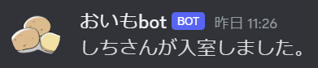

# おいもbot
バトオペ用Discordbotのお試し版です。

# 機能
## ボイスチャンネル入退室ログ
ボイスチャンネル入退室時に任意のチャンネルにメッセージを送信します。

## 自動チーム分けおよび自動ボイスチャンネル移動
レーティング値を登録してレーティングの差がないようなチームに分けたり、ランダムなチームに分けたりすることができます。  
 
## 読み上げ
[gTTS(Google Text-to-Speech)](https://github.com/pndurette/gTTS)を用いて、テキストチャンネルに送信されたメッセージをボイスチャンネル内で読み上げます。

# 使い方
## 招待
[こちら](https://discord.com/api/oauth2/authorize?client_id=1114472393247821926&permissions=2167408640&scope=bot)からbotを自分のサーバーに招待します。
## 送信先設定
自分のサーバーに招待すると設定メッセージが一番上のテキストチャンネルに送信されます。  
ログおよびチーム決めのボタンを送信させたいチャンネルをリストから選択して、決定をクリックします。  

設定が完了するとメッセージが設定したチャンネルに送信されます。  

**新しくチャンネルを作成した場合などでリストに設定したいチャンネルがないときには「リスト更新」ボタンを押してください。**  
この設定はチーム決めボタンのメッセージの「設定」からいつでも行うことができます。  

## 読み上げ
ボイスチャンネルに入室すると自動でbotも入室します。  
botがボイスチャンネルにいる間、テキストチャンネルに送信されたメッセージを読み上げます。  
  

ボイスチャンネルに誰もいなくなると自動でbotも退室します。  

## チーム決め
ボイスチャンネルに入室すると以下のメッセージが送信されます。  

「チーム決め」ボタンをクリックすると以下のメッセージが送信されます。  

レーティングを登録してレーティング差が一番少ないチームに分ける場合は[レートチーム分け](#レートチーム分け)  
ランダムにチームを分ける場合は[ランダムチーム分け](#ランダムチーム分け)  
を参照してください。

### レートチーム分け
「登録」ボタンをクリックすると以下のようなウインドウが表示されるので、レートを入力して「送信」ボタンをクリックしてください。  

登録が完了すると以下のようなメッセージが送信されます。
「レート登録状況」はボイスチャンネル内にいるメンバーの登録状況を表しています。  

全員の登録が完了したら「チーム分け」ボタンをクリックします。  
すると以下のメッセージが送信されるので「決定」ボタンをクリックしてチームを決定します。  

チーム分けの結果が表示されます。  

### ランダムチーム分け
「チーム分け」ボタンをクリック後、「レーティング平均」を「ランダム」に変更し、決定をクリックします。  

チームが決定されます。  

ランダムチーム分けでは、**ミュートしていないボイスチャンネルにいるメンバー**でチームを決定します。

## ボイスチャンネル移動
チームを決定した状態で「ボイスチャット移動」ボタンをクリックすると，決定されたチームでのボイスチャンネルへの移動を行います。  

**注意：分けるチーム数+1の数のボイスチャンネルを作成しておいてください。(チャンネル名はなんでもよいです。)**

# 注意事項
MIT Licenseにあるように作者または著作権者は、ソフトウェアに関してなんら責任を負いません。  
予告なくbotを停止することがあります。

# 説明(更新予定)

## discordbot.py
PythonによるDiscordBotのアプリケーションファイルです。

## cogs
## eventcog.py
各種イベント(ボイスチャンネル入室時、メッセージが送信時)での処理を記述したファイルです。
## maincog.py
通常コマンドのファイルです。

## requirements.txt
使用しているPythonのライブラリ情報の設定ファイルです。

## .github/workflows/fly.yml
fly.ioのデプロイ用ファイルです。

## LICENSE
このリポジトリのコードの権利情報です。MITライセンスの範囲でご自由にご利用ください。

## README.md
このドキュメントです。